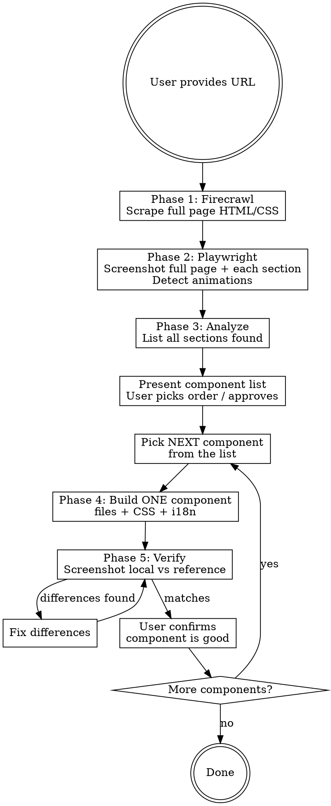

y---
name: website-replicator
description: >
  Use when the user provides a website URL and wants to replicate it in their current Next.js project.
  Use when the user says "make it like this site", "copy this website", "replicate this design",
  "extract from this URL", or shares a URL they want to recreate. Also use when the user wants to
  analyze a live website's structure, layout, animations, and components to rebuild them locally.
---

# Website Replicator

Orchestrated workflow to analyze a live website and recreate its components in the current Next.js project, respecting CLAUDE.md conventions.

## Overview

This skill coordinates four tools in sequence:
1. **Firecrawl** — scrape HTML/CSS structure
2. **Playwright** — screenshot each section + detect animations
3. **Analysis** — map sections to project conventions
4. **Build** — create each component with project-standard CSS

## Prerequisites

Before starting, verify:
- `firecrawl` CLI is installed and authenticated (`firecrawl --status`)
- Playwright MCP is available (check for `browser_navigate` tool)
- The current project has a `CLAUDE.md` with conventions

If firecrawl is not installed:
```bash
npm install -g firecrawl-cli
firecrawl login --browser
```

## CRITICAL RULE: One Component at a Time

**NEVER build all components at once.** The workflow is strictly sequential — one component per cycle:

1. Scrape + screenshot the FULL page (once, at the start)
2. Analyze and list ALL sections found
3. Present the component list to user for approval
4. **For EACH component, one at a time:**
   - Build it (files + CSS + i18n strings)
   - Verify it (screenshot local vs reference)
   - Fix any differences
   - Get user confirmation before moving to next
5. Only move to the next component after the current one is verified

**Why:** Building everything at once makes it impossible to catch and fix issues. Component-by-component lets the user course-correct early.

## Workflow



## Phase 1: Scrape with Firecrawl

Run these commands to understand the site structure:

```bash
# Map all pages on the site
firecrawl map <url>

# Scrape the target page as clean markdown + HTML
firecrawl scrape <url> --format html,markdown

# If the site is an SPA, use browser mode
firecrawl browser <url>
```

**Extract from the scrape:**
- Page sections (header, hero, features, pricing, footer, etc.)
- CSS class naming patterns
- Color palette (background colors, text colors, accents)
- Typography (font families, sizes, weights)
- Layout structure (grid, flexbox, max-widths)
- Image URLs and SVG icons

Save the scraped output to a temporary file for reference:
```bash
firecrawl scrape <url> --format html > /tmp/site-scrape.html
firecrawl scrape <url> --format markdown > /tmp/site-scrape.md
```

## Phase 2: Screenshot + Animation Detection with Playwright

### Screenshots

Take full-page and per-section screenshots:

1. Navigate to the URL with `browser_navigate`
2. Take a full-page screenshot with `browser_take_screenshot`
3. Scroll through the page, taking screenshots at each major section
4. Take screenshots at different viewport widths:
   - Desktop (1440px)
   - Tablet (1024px)
   - Mobile (768px)

### Animation Detection

Run JavaScript via `browser_evaluate` to detect animation libraries and CSS animations:

```javascript
// Detect animation libraries
const libs = {
  gsap: !!window.gsap,
  framerMotion: !!window.__FRAMER_MOTION__,
  animejs: !!window.anime,
  aos: !!window.AOS,
  scrollReveal: !!window.ScrollReveal,
  lenis: !!window.__lenis,
};

// Extract CSS keyframes
const keyframes = [];
for (const sheet of document.styleSheets) {
  try {
    for (const rule of sheet.cssRules) {
      if (rule instanceof CSSKeyframesRule) {
        keyframes.push({ name: rule.name, css: rule.cssText });
      }
    }
  } catch(e) {} // cross-origin sheets
}

// Find elements with CSS transitions/animations
const animated = [];
document.querySelectorAll('*').forEach(el => {
  const s = getComputedStyle(el);
  if (s.animation !== 'none' || s.transition !== 'none 0s ease 0s') {
    animated.push({
      tag: el.tagName,
      class: el.className,
      animation: s.animationName,
      transition: s.transition,
    });
  }
});

// Find scroll-triggered elements (common data attributes)
const scrollTriggered = document.querySelectorAll(
  '[data-aos], [data-scroll], [data-animate], [data-gsap], [data-framer], [data-inview]'
);

JSON.stringify({ libs, keyframes, animated: animated.slice(0, 50), scrollTriggered: scrollTriggered.length }, null, 2);
```

### Scroll Observation

Scroll the page slowly to trigger scroll-based animations:

1. Start at top, take snapshot
2. Scroll down in 500px increments
3. After each scroll, wait 1 second, then take snapshot
4. Note which elements appeared/changed between scrolls (these are scroll-animated)

## Phase 3: Analyze and Plan

From the scraped HTML and screenshots, create a component map:

**For each section, document:**
- Section name and purpose
- HTML structure summary
- Key CSS properties (layout, colors, spacing)
- Animations observed (type, trigger, duration, easing)
- Whether it needs to be a server or client component
- i18n strings to extract to `messages/en.json`

**Present the plan to the user:**

```
## Extraction Plan for [website]

### Sections Found:
1. **Navbar** — Fixed top nav with logo, links, CTA button
   - Animation: none
   - Component type: server

2. **Hero** — Full-width hero with heading, subtitle, CTA
   - Animation: fade-in on load, parallax background
   - Component type: client (needs GSAP for animations)

3. **Features** — 3-column grid with icons
   - Animation: stagger fade-in on scroll
   - Component type: client (scroll trigger)

[etc.]

### Design Tokens Detected:
- Primary: #1a2b3c
- Background: #ffffff
- Font: Inter, sans-serif

Proceed with extraction? (y/n)
```

Wait for user approval before building.

## Phase 4: Build ONE Component

**Build exactly ONE component per cycle.** Do not start the next until this one is verified.

Read CLAUDE.md first to know the project's conventions.

**Per-component checklist:**
1. Create the component file in the correct directory (e.g., `src/components/sections/`)
2. Create its CSS file in `src/styles/` with BEM naming
3. Add `@import '../styles/<name>.css';` to `globals.css`
4. Add all visible text to `messages/en.json` under a new namespace
5. Use `getTranslations('Namespace')` (server) or `useTranslations('Namespace')` (client)
6. Add responsive breakpoints (desktop-first, `max-width` only)
7. If the component has animations, add them (see Animation section below)

**For animations:**
- CSS animations/transitions: put in the component's CSS file
- Scroll-triggered animations: use GSAP + ScrollTrigger in a client component
- Mount/unmount transitions: use Framer Motion in a client component
- Always wrap GSAP in `useEffect` with `gsap.context()` for cleanup

**Recommended build order** (suggest to user, they decide):
1. Design tokens first (update `tokens.css` if new colors/fonts needed)
2. Layout components (Navbar, Footer)
3. Content sections top-to-bottom (Hero, Features, etc.)
4. Interactive elements last

**After building, immediately go to Phase 5 (Verify) for THIS component.**

## Phase 5: Verify THIS Component

**Immediately after building ONE component, verify it before touching anything else.**

1. Start the dev server if not running (`npm run dev`)
2. Use Playwright to screenshot the local page showing this component
3. Compare side-by-side with the reference screenshot from Phase 2
4. Fix any differences in:
   - Spacing and padding
   - Font sizes and weights
   - Colors
   - Layout alignment
   - Responsive behavior
   - Animation timing
5. **Do at least two comparison rounds**
6. **Ask the user: "Component X looks good. Ready to move to the next one?"**
7. Only proceed to the next component after user confirms

**If the user wants changes:** fix them, re-verify, then ask again.

## Animation Recreation Reference

| Observed Animation | Recreate With | Pattern |
|---|---|---|
| Fade-in on page load | Framer Motion `initial`/`animate` | `initial={{ opacity: 0 }} animate={{ opacity: 1 }}` |
| Slide-in on scroll | GSAP ScrollTrigger | `gsap.from(el, { y: 50, opacity: 0, scrollTrigger: { trigger: el } })` |
| Staggered children | GSAP `stagger` or Framer `staggerChildren` | `stagger: 0.1` or `transition: { staggerChildren: 0.1 }` |
| Parallax background | GSAP ScrollTrigger | `gsap.to(bg, { y: -100, scrollTrigger: { scrub: true } })` |
| Hover effects | CSS transitions | `transition: transform 0.3s ease` in CSS file |
| Typewriter text | GSAP or custom hook | `gsap.to(el, { text: "...", duration: 2 })` |
| Counter/number tick | GSAP | `gsap.to({}, { duration: 2, onUpdate: ... })` |
| Smooth scroll | CSS or Lenis | `scroll-behavior: smooth` or Lenis library |

## Common Mistakes

- **Don't hardcode text in JSX** — always use i18n translation keys
- **Don't use Tailwind or CSS modules** — use plain CSS with BEM (unless CLAUDE.md says otherwise)
- **Don't skip responsive** — always check tablet (1024px) and mobile (768px) breakpoints
- **Don't guess animations** — screenshot at different scroll positions to see what actually moves
- **Don't build everything before verifying** — verify each section as you go
- **Don't ignore CLAUDE.md** — it defines the project's conventions, always read it first
