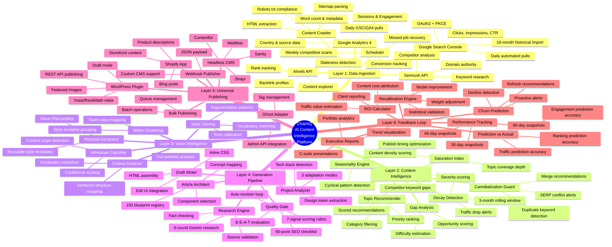

# ChainIQ Platform — Feature Mind Map

## Reading the Mind Map

- **Center:** ChainIQ platform as the root
- **First ring:** The 6 architectural layers, each independently valuable
- **Second ring:** Major capabilities within each layer
- **Third ring:** Specific features and implementation details

Each layer builds on the one above it, but can also function independently for clients who need only a subset of the platform.
