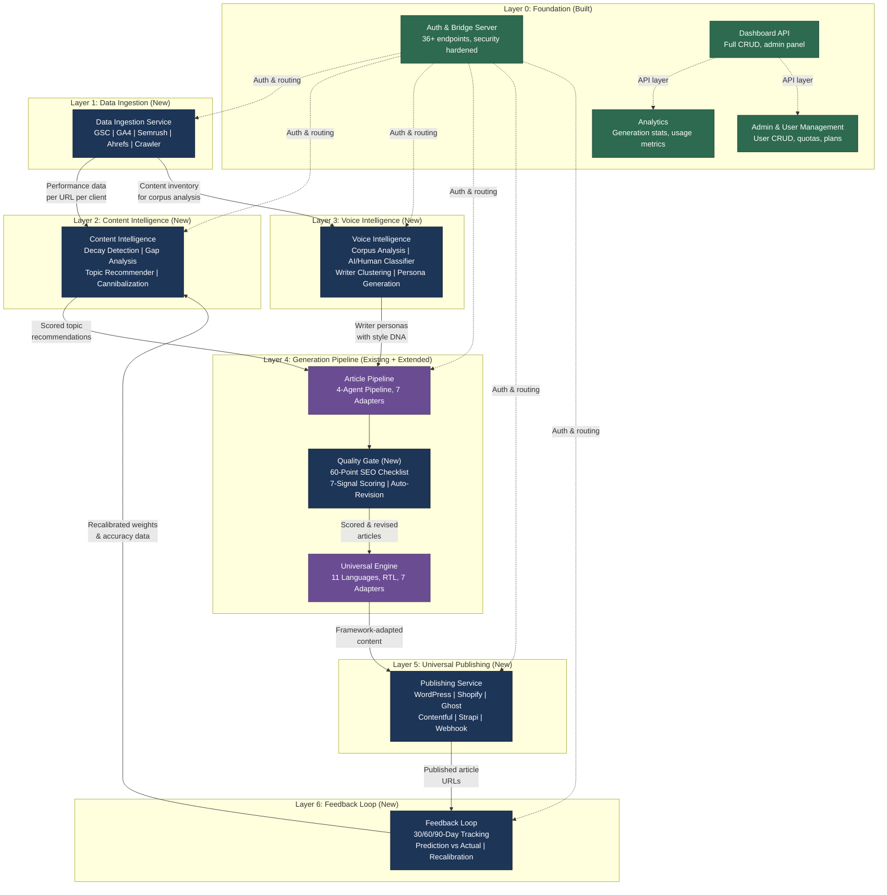

# ChainIQ Service Map — All 12 Services by Layer

## Legend

| Color | Meaning |
|-------|---------|
| Green | Existing service (built in v1) |
| Blue | New service (platform expansion) |
| Purple | Existing service being extended |

## Data Flow Summary

1. **Data Ingestion** pulls raw performance data from Google Search Console, Google Analytics, Semrush, and Ahrefs, plus crawls website content
2. **Content Intelligence** analyzes that data to detect decaying content, find keyword gaps, and produce scored topic recommendations
3. **Voice Intelligence** uses the crawled content inventory to analyze writer portfolios and generate reusable voice profiles
4. **Article Pipeline** receives topic recommendations and voice personas, then generates articles through the 4-agent pipeline
5. **Quality Gate** scores each article against a 60-point SEO checklist and 7-signal rubric, auto-revising until quality thresholds are met
6. **Universal Engine** adapts the content for the target framework and language
7. **Publishing Service** pushes the final article to WordPress, Shopify, Ghost, or any connected CMS as a draft
8. **Feedback Loop** tracks published articles at 30, 60, and 90 days, compares predictions vs. actuals, and sends recalibrated weights back to Content Intelligence -- closing the loop and making the system smarter over time
