# ChainIQ System Architecture Flowchart

```mermaid
graph LR
    subgraph "External Data Sources"
        GSC["Google Search Console<br/>Clicks, Impressions, CTR, Position"]
        GA4["Google Analytics 4<br/>Sessions, Engagement, Conversions"]
        SEM["Semrush API<br/>Keyword data, Competitor analysis"]
        AHR["Ahrefs API<br/>Backlinks, Domain authority"]
        WEB["Target Websites<br/>Sitemap, Content, Metadata"]
    end

    subgraph "Authentication Layer"
        OAUTH["Google OAuth2<br/>PKCE + Token Encryption"]
        APIKEYS["API Key Management<br/>Semrush + Ahrefs credentials"]
    end

    subgraph "Infrastructure (Hetzner + Coolify)"
        subgraph "Bridge Server (Node.js)"
            ROUTER["Route Handler<br/>Auth middleware, Rate limiting"]
            SCHED["Scheduler<br/>Daily GSC/GA4, Weekly Semrush/Ahrefs"]
            CRAWL["Content Crawler<br/>Sitemap parser, HTML extractor"]
        end

        subgraph "Intelligence Engine"
            DECAY["Decay Detection<br/>3-month rolling window"]
            GAP["Gap Analysis<br/>Keyword opportunities"]
            TOPIC["Topic Recommender<br/>Scored recommendations"]
            CANNIBAL["Cannibalization Guard<br/>Duplicate keyword detection"]
        end

        subgraph "Voice Engine"
            CORPUS["Corpus Analyzer<br/>Stylometric features"]
            CLASSIFY["AI/Human Classifier<br/>Content origin detection"]
            CLUSTER["Writer Clustering<br/>Style grouping"]
            PERSONA["Persona Generator<br/>Voice DNA profiles"]
        end

        subgraph "Generation Pipeline"
            PA["Project Analyzer<br/>Detect stack, tokens, style"]
            RE["Research Engine<br/>6-round Gemini research"]
            AA["Article Architect<br/>Concepts to structure"]
            DW["Draft Writer<br/>HTML + inline CSS"]
            QG["Quality Gate<br/>7-signal scoring + auto-revision"]
        end

        subgraph "Publishing Pipeline"
            WP["WordPress Plugin<br/>REST API + Yoast/RankMath"]
            SHOP["Shopify App<br/>Storefront content"]
            GHOST["Ghost Adapter<br/>Admin API"]
            HOOK["Webhook Publisher<br/>Custom CMS integration"]
        end

        subgraph "Feedback Engine"
            TRACK["Performance Tracker<br/>30/60/90-day snapshots"]
            COMPARE["Prediction vs Actual<br/>Accuracy scoring"]
            RECAL["Recalibration Engine<br/>Weight adjustment"]
            ROI["ROI Calculator<br/>Traffic value estimation"]
        end
    end

    subgraph "Data Layer (Supabase)"
        DB[("PostgreSQL<br/>6 new tables + RLS<br/>Partitioned snapshots")]
        AUTH["Supabase Auth<br/>JWT + Row Level Security"]
    end

    subgraph "CMS Targets"
        WPSITE["WordPress Sites"]
        SHOPSITE["Shopify Stores"]
        GHOSTSITE["Ghost Blogs"]
        CMSSITE["Headless CMS<br/>Contentful, Strapi, Sanity"]
    end

    subgraph "AI Services"
        CLAUDE["Claude API<br/>Article generation + revision"]
        GEMINI["Gemini MCP<br/>Research + image generation"]
    end

    %% External sources to ingestion
    GSC -->|"OAuth2"| OAUTH
    GA4 -->|"OAuth2"| OAUTH
    SEM -->|"API key"| APIKEYS
    AHR -->|"API key"| APIKEYS
    OAUTH --> SCHED
    APIKEYS --> SCHED
    WEB --> CRAWL

    %% Ingestion to database
    SCHED --> DB
    CRAWL --> DB

    %% Database to intelligence
    DB --> DECAY
    DB --> GAP
    DECAY --> TOPIC
    GAP --> TOPIC
    CANNIBAL --> TOPIC

    %% Intelligence to voice
    DB --> CORPUS
    CORPUS --> CLASSIFY
    CLASSIFY --> CLUSTER
    CLUSTER --> PERSONA

    %% Topic + Voice to generation
    TOPIC --> PA
    PERSONA --> PA
    PA --> RE
    RE --> AA
    AA --> DW
    DW --> QG

    %% AI services
    CLAUDE -.-> DW
    CLAUDE -.-> QG
    GEMINI -.-> RE

    %% Quality gate to publishing
    QG --> WP
    QG --> SHOP
    QG --> GHOST
    QG --> HOOK

    %% Publishing to CMS targets
    WP --> WPSITE
    SHOP --> SHOPSITE
    GHOST --> GHOSTSITE
    HOOK --> CMSSITE

    %% Published articles to feedback
    WPSITE --> TRACK
    SHOPSITE --> TRACK
    GHOSTSITE --> TRACK
    TRACK --> COMPARE
    COMPARE --> RECAL
    RECAL --> ROI
    RECAL -->|"Updated weights"| TOPIC

    %% Auth layer
    AUTH -.-> ROUTER
    ROUTER -.-> SCHED
    ROUTER -.-> CRAWL

    %% Feedback to database
    TRACK --> DB
    COMPARE --> DB

    %% Styling
    classDef external fill:#e76f51,stroke:#c94f2e,color:#fff
    classDef infra fill:#264653,stroke:#1a3040,color:#fff
    classDef data fill:#2a9d8f,stroke:#1e7268,color:#fff
    classDef cms fill:#e9c46a,stroke:#c9a43a,color:#333
    classDef ai fill:#9b5de5,stroke:#7a3fbf,color:#fff

    class GSC,GA4,SEM,AHR,WEB external
    class ROUTER,SCHED,CRAWL,DECAY,GAP,TOPIC,CANNIBAL,CORPUS,CLASSIFY,CLUSTER,PERSONA,PA,RE,AA,DW,QG,WP,SHOP,GHOST,HOOK,TRACK,COMPARE,RECAL,ROI,OAUTH,APIKEYS infra
    class DB,AUTH data
    class WPSITE,SHOPSITE,GHOSTSITE,CMSSITE cms
    class CLAUDE,GEMINI ai
```

## Architecture Highlights

- **External data sources** (left) feed into the system through authenticated connectors
- **Hetzner + Coolify** hosts all processing on a single, cost-efficient server
- **Supabase** provides the database with row-level security for multi-tenant isolation
- **Claude and Gemini** are the AI services powering generation and research
- **CMS targets** (right) receive published content as drafts
- **The feedback loop** (bottom) feeds recalibrated data back into the intelligence engine, creating a self-improving cycle
