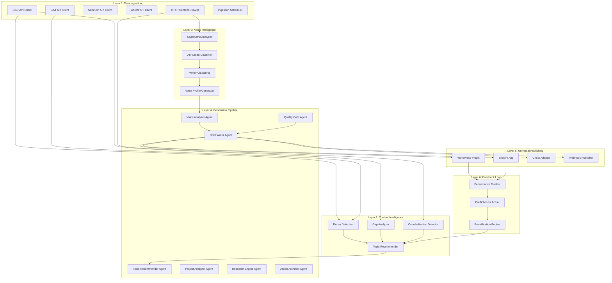

# ChainIQ System Architecture

**Last Updated:** 2026-03-28
**Source:** Backend feasibility assessment, PROJECT-BRIEF, tribunal technical consensus
**Audience:** Engineering, DevOps, security review
**Scope:** 6-layer platform architecture with cross-layer data flows

---

## Architecture Overview



---

## Core Infrastructure

### Bridge Server

The bridge server is the central backend process. It is a **long-running Node.js process with zero npm dependencies**, using only Node's built-in modules (`http`, `crypto`, `child_process`, `fs`, `path`) and the native `fetch` API (Node 18+).

**Current state:** 1,471-line monolith (`bridge/server.js`) with 48 route handlers in a giant `if/else` chain inside a single `http.createServer()` callback. No Express, no Koa, no router library.

**Target state after route splitting (Sprint 1):**

```text
bridge/
  server.js              (~300 lines: middleware, CORS, rate limiting, dispatch)
  routes/
    auth.js              (existing: signup, login, verify)
    admin.js             (existing: users, approve, revoke, delete, usage)
    articles.js          (existing: CRUD)
    pipeline.js          (existing: status, queue, history)
    generate.js          (existing: generate, queue ops)
    settings.js          (existing: get/put settings, quota)
    keys.js              (existing: API key CRUD)
    blueprints.js        (existing: list, categories)
    edit.js              (existing: apply-edit SSE)
    webhooks.js          (existing: CRUD)
    plugin.js            (existing: heartbeat, config, analytics)
    connections.js       (NEW: OAuth flows, account management)
    inventory.js         (NEW: content inventory CRUD)
    intelligence.js      (NEW: decay, gaps, cannibalization, recommendations)
    voice.js             (NEW: personas, corpus analysis)
    publish.js           (NEW: CMS push, history)
    performance.js       (NEW: predictions, tracking, recalibration)
  oauth.js               (Google OAuth2 flow)
  ingestion/
    gsc.js               (GSC Search Analytics API client)
    ga4.js               (GA4 Reporting API client)
    semrush.js           (Semrush API client)
    ahrefs.js            (Ahrefs API client)
    trends.js            (Google Trends client)
    crawler.js           (HTTP content crawler)
    scheduler.js         (Daily/weekly pull scheduler)
  intelligence/
    decay-detector.js    (Content decay detection)
    gap-analyzer.js      (Keyword gap analysis)
    cannibalization.js   (URL cannibalization)
    voice-analyzer.js    (Stylometric analysis, AI classification, clustering)
    performance-tracker.js (Prediction vs actual, recalibration)
  publishing/
    wordpress.js         (WordPress REST API client)
    shopify.js           (Shopify Admin Blog API client)
    ghost.js             (Ghost Admin API client)
```

Each route module exports a function `(req, res, { auth, readBody, json, supabase, ...helpers })` that returns `true` if it handled the request, `false` otherwise. The core server.js iterates through route modules in order. This preserves the zero-dep constraint while achieving separation.

### Middleware Chain (Inline, Sequential)

1. CORS headers (allowlist of dashboard domain + plugin origins, not wildcard)
2. OPTIONS preflight handling
3. Request logging via `logger.logRequest()`
4. Per-route auth (`requireAuth()` or `requireAdmin()`)
5. Rate limiting via in-memory `Map` with 60-second windows
6. Auth verification cache (SHA-256 hashed tokens, 30-second TTL)
7. Request body parsing (`readBody()` with 64KB limit)
8. Input validation (inline per endpoint)
9. Response logging via patched `json()` helper

---

## Layer 1: Data Ingestion

### Connectors

All API clients use native `fetch` (zero npm deps). Each connector normalizes data into a unified **ContentPerformanceRecord**:

```text
ContentPerformanceRecord {
  url:         "/blog/n54-hpfp-symptoms"
  title:       "N54 HPFP Failure Symptoms"
  publishDate: "2025-06-14"
  author:      "Mike T."
  wordCount:   2840
  gsc:         { clicks: 1420, impressions: 28300, ctr: 5.02, avgPosition: 8.2 }
  ga4:         { sessions: 1680, engagementRate: 72, scrollDepth: 64 }
  semrush:     { organicTraffic: 1350, keywords: 47, topKeywordKD: 32 }
  ahrefs:      { backlinks: 14, referringDomains: 8, domainRating: 42 }
  trend:       { 3moChange: -18, 6moChange: -34, seasonal: "peaks Oct-Dec" }
  status:      "DECAYING"
}
```

**Google OAuth2 flow (zero-dep implementation):**
1. Auth URL generation: string concatenation with `accounts.google.com/o/oauth2/v2/auth`
2. Token exchange: `fetch()` POST to `oauth2.googleapis.com/token`
3. Token refresh: same endpoint, `grant_type=refresh_token`
4. PKCE: `crypto.randomBytes(32)` for code_verifier, `crypto.createHash('sha256')` for challenge
5. Token encryption at rest: reuse `KeyManager.encrypt()` / `KeyManager.decrypt()` (AES-256-GCM)

**Scheduler architecture:**
- `setInterval`-based with drift correction (hybrid approach)
- Last-run timestamps stored in Supabase
- On process restart: check timestamps, execute immediately if >24h stale
- Dead man's switch: Uptime Kuma on Hetzner pings `/health` every 5 minutes
- Daily schedule: GSC + GA4 pulls at 03:00 UTC
- Weekly schedule: Semrush + Ahrefs pulls (Phase B)

**Content crawler:**
- Crawls sitemap.xml first (fast path), falls back to link-following
- Extracts: URL, title, meta description, H1, word count, publish date, last modified
- Regex-based HTML extraction (works for ~80% of sites)
- Respects robots.txt, rate-limited to 2 requests/second
- Limitation: regex fails on JavaScript-rendered pages. Robust parsing deferred to Phase D.

### Caching and Cost Management

API cost is the primary variable cost per client. The 7-day caching layer is essential:

- Cache Semrush/Ahrefs responses in an `api_cache` table (key: provider+endpoint+params hash, value: JSONB, expires_at)
- TTL: 7 days for keyword data, 1 day for SERP data, 30 days for backlink profiles
- Cache-aside pattern: check cache, if miss then fetch from API + store
- Estimated cost reduction: 60-70%

**GOTCHA (database):** Supabase Pro provides 8GB storage. A single enterprise client with 10,000 URLs generates ~300K performance_snapshots rows/month at ~200 bytes/row = ~60MB/month. Without aggregation, a single client fills 8GB in ~4 months. The 90-day purge + monthly rollup keeps storage under 2GB indefinitely.

---

## Layer 2: Content Intelligence

### 6-Analysis Pipeline (Mode B: Agent-Recommended)

1. **Content Inventory** -- crawl the site, build a map of every article with metadata
2. **Decay Detection** -- flag articles with 3+ months declining impressions or 20%+ single-month drop
3. **Gap Analysis** -- find high-volume keywords client does not rank for but competitors do
4. **Seasonality Check** -- adjust opportunity scores based on seasonal demand curves
5. **Saturation Index** -- score SERP difficulty (thin/outdated = high opportunity, deep/authoritative = low)
6. **Cannibalization Guard** -- check if client already ranks for keyword, recommend refresh vs new

### Scoring Formula

```text
priority = (impressions * 0.3) + (decay_severity * 0.25) + (gap_size * 0.25)
         + (seasonality_bonus * 0.1) + (competition_inverse * 0.1)
```

Weights are recalibrated by the feedback loop (Layer 6) after 3+ months of prediction-vs-actual data.

### Mode A vs Mode B

- **Mode A (User-Driven):** User provides a keyword. Pipeline executes. No intelligence layer involved. This is what v1 does today.
- **Mode B (Agent-Recommended):** User provides a category. The intelligence layer returns a ranked list of specific articles to write, each scored and justified with data. This is the product's core value.

---

## Layer 3: Voice Intelligence

### 4-Step Process

**Step 1: Corpus Collection.** Crawl client's site, collect 50-100 articles minimum. Extract raw text, strip HTML, preserve paragraph structure. Associate with author name where available.

**Step 2: AI vs Human Classification.** Stylometric analysis on each article classifying as HUMAN, HYBRID, or AI-GENERATED. Signals: sentence length variance, vocabulary richness (TTR), hedging frequency, cliche density, em-dash frequency, paragraph rhythm.

**Step 3: Writer Clustering.** Using only HUMAN articles, cluster by writing style fingerprint. NLP features: sentence structure, tone, formality, vocabulary, use of analogies, humor, technical depth. K-means for MVP (pure JS, ~100 lines), HDBSCAN upgrade later via Python shim.

**Step 4: Persona Generation.** Structured JSON profile per detected writer persona, injected into draft-writer agent as a style constraint.

### HDBSCAN Decision

HDBSCAN is the only feature that challenges the zero-dep constraint. Three options evaluated:

1. **K-means in pure JS** (recommended for MVP) -- ~100 lines, run k=2 through k=8, pick best silhouette score
2. **Python shell-out** (recommended for production) -- `child_process.spawn('python3', ['cluster.py'])`, zero npm deps in Node
3. **Break zero-dep rule** -- add `ml-hdbscan` to package.json. Sets a precedent.

Recommendation: Option 1 for MVP, Option 2 when accuracy demands it.

---

## Layer 4: Generation Pipeline (7-Agent Article Factory)

| # | Agent | Status | Input | Output |
|----|-------|--------|-------|--------|
| 1 | Topic Recommender | NEW | Category + client site URL | Ranked article recommendations with scores |
| 2 | Voice Analyzer | NEW | Client site URL | Writer personas (DNA profiles) |
| 3 | Project Analyzer | EXISTS | Target project directory or URL | Shell detection, design tokens, component inventory |
| 4 | Research Engine | EXISTS | Topic + domain lock | 6-round research report + image prompts |
| 5 | Article Architect | EXISTS | Research report + component inventory | Concepts, architecture, TOC, image plan |
| 6 | Draft Writer | MODIFY | Architecture + research + voice persona + tokens | Framework-native article with inline edit UI |
| 7 | Quality Gate | NEW | Generated article + target persona | 7-signal quality score. Below 7/10 = auto-revision |

### 3 Adaptation Modes

1. **Existing Components** -- project has its own component library; ChainIQ detects and uses them
2. **Registry Blueprints** -- project has no components; ChainIQ uses 193 structural blueprints with project's design tokens
3. **Fallback Generation** -- no project detected; self-contained HTML with inline CSS and edit UI

### Quality Gate: 7-Signal Scoring Rubric

| Signal | Weight | Threshold |
|--------|--------|-----------|
| E-E-A-T Signals | 20% | >= 7/10 |
| Topical Completeness | 20% | >= 80% coverage |
| Voice Match | 15% | <= 0.3 stylometric distance |
| AI Detection Score | 15% | >= 85% human |
| Freshness Signals | 10% | All data <= 6 months old |
| Technical SEO | 10% | >= 9/10 |
| Readability | 10% | Flesch-Kincaid Grade 8-12 |

Auto-revision loop: below 7/10 on any signal triggers draft-writer re-invocation with targeted fix instructions. Max 2 revision passes. Still below threshold = flag for human review.

---

## Layer 5: Universal Publishing

All plugins are **thin SaaS-connected clients** -- intelligence runs on the ChainIQ backend (Hetzner + Coolify) to protect IP. Plugins make API calls to the bridge server; they do not contain intelligence logic.

### Universal Article Payload Format

Canonical JSON consumed by all CMS adapters: title, body (HTML), meta title, meta description, focus keyphrase, featured image URL, categories, tags, schema markup, author, publish date.

### WordPress Plugin

Operates at the `wp_posts` database level via `wp_insert_post()`, not at the builder level. WordPress stores content in the same table regardless of builder (Gutenberg, Elementor, WPBakery, Classic Editor). This is why it works with every builder -- it does not compete with them.

Features: ChainIQ menu in wp-admin, article generation (Mode A/B), content health dashboard, auto-sets categories/tags/featured image/Yoast/RankMath SEO meta, always creates as Draft first.

**GOTCHA (deployment):** WordPress plugin submission to the WordPress.org plugin repository takes 1-4 weeks for initial review. Submit early. For the SRMG pilot, distribute the plugin directly (not through the repository) while review is pending.

### Shopify App

Embedded admin app using Shopify Blog API. Product-aware -- can reference the store's catalog. Simpler than WordPress (single content path, Liquid-native).

---

## Layer 6: Feedback Loop

### Tracking Pipeline

1. Article published via Layer 5 with predicted performance metrics
2. At 30, 60, and 90 days: pull actual GSC + GA4 data for the article URL
3. Compare prediction to actual, compute accuracy score (normalized 0-100)
4. Store in `performance_predictions` table
5. After 3+ months of data: recalibrate scoring formula weights per client

### Recalibration Engine

Statistical model adjusts the Layer 2 opportunity scoring weights per client. The factors that predicted well get more weight; the factors that predicted poorly get less weight. This is the compounding data moat -- after 12 months, the calibration data is specific to the client's domain, audience, and content type, and cannot be replicated by a competitor launching later.

---

## Cross-Layer Data Flows

```text
Layer 1 (Ingestion)  --> Supabase tables: content_inventory, performance_snapshots, keyword_opportunities
                     --> client_connections (OAuth tokens, encrypted)

Layer 2 (Intelligence) reads from: content_inventory, performance_snapshots, keyword_opportunities
                       writes to: keyword_opportunities (scored recommendations)

Layer 3 (Voice)      reads from: content_inventory (article corpus)
                     writes to: writer_personas (detected profiles)

Layer 4 (Generation) reads from: keyword_opportunities (topic), writer_personas (voice)
                     writes to: articles (generated content)

Layer 5 (Publishing) reads from: articles (content to publish)
                     writes to: articles (published URL, CMS post ID)

Layer 6 (Feedback)   reads from: articles (predictions), performance_snapshots (actuals)
                     writes to: performance_predictions (comparison), keyword_opportunities (recalibrated weights)
```

---

## Database Schema (6 New Tables)

All tables use UUID primary keys, include `created_at` and `updated_at` timestamps, and have RLS policies enforcing `auth.uid() = user_id` for multi-tenant isolation.

| Table | Est. Rows/Client/Month | RLS Complexity | Key Indexes |
|-------|----------------------|----------------|-------------|
| client_connections | ~10 (static) | Low | user_id |
| content_inventory | ~10K initial, ~500 delta/mo | Low | (user_id, url) UNIQUE |
| performance_snapshots | ~300,000 | Medium | (user_id, snapshot_date DESC), (content_id, snapshot_date DESC) |
| keyword_opportunities | ~500-2,000 | Low | (user_id, status, priority_score DESC) |
| writer_personas | ~5-20 (static) | Low | user_id |
| performance_predictions | ~100-500 | Low | user_id, article_id |

### performance_snapshots Mitigation (Required)

This table is the growth risk (Risk #2, score 20/25). Without mitigation, query performance degrades within 6 months.

1. **Partition by month:** PostgreSQL range partitioning on `snapshot_date`
2. **90-day rolling purge:** Delete daily granularity older than 90 days after rollup
3. **Monthly rollup table:** `performance_snapshots_monthly` with aggregated averages
4. **Query discipline:** All dashboard queries MUST include `user_id` AND date range in WHERE clause

**GOTCHA (database):** PostgreSQL does NOT auto-index foreign key columns. Every FK column across all 6 tables needs an explicit index. Missing the index on `content_id` in `performance_snapshots` will cause full table scans on the most queried table.

**GOTCHA (database):** Always use UUID primary keys, not auto-increment. In a multi-tenant SaaS, auto-increment IDs leak tenant record counts and creation rates.

**GOTCHA (database):** SQL dates vs JavaScript dates cause timezone issues. GSC returns UTC dates. The dashboard displays in the client's timezone. Use consistent UTC throughout the backend; convert only at the display layer. Inconsistent handling leads to "off by one day" bugs in decay detection.

### Scheduler Uses service_role Key

The daily data pull scheduler runs server-side, not as a user. It uses the Supabase `service_role` key which bypasses RLS entirely. This is the same pattern used for existing admin operations. The `service_role` key must NEVER be exposed to clients -- it is the single most sensitive credential in the system.

---

## Security Architecture

### Authentication

- **Dashboard users:** Supabase Auth (email/password, JWT tokens)
- **Bridge server API:** Bearer token validation via `verifyAuth()` middleware
- **OAuth tokens:** AES-256-GCM encryption at rest via `KeyManager` (existing, proven pattern)
- **API keys:** AES-256-GCM encrypted storage (existing, proven pattern)
- **CMS plugins:** SaaS-connected thin clients authenticating to bridge server via API key

### Token Security

OAuth tokens (access_token + refresh_token) are stored encrypted in `client_connections`:
- `access_token_encrypted` (TEXT) -- AES-256-GCM via KeyManager
- `refresh_token_encrypted` (TEXT) -- AES-256-GCM via KeyManager
- Proactive refresh: renew 10 minutes before expiry, not at expiry
- Retry: exponential backoff on refresh failure (3 attempts over 15 minutes)
- After 3 failed refreshes: mark connection as `expired`, surface alert in dashboard

**GOTCHA (deployment):** Environment variables with trailing newlines break crypto operations silently on Windows. When setting `BRIDGE_ENCRYPTION_KEY`, use `node -e "process.stdout.write('value')"` -- never `echo`.

### Multi-Tenant Isolation

RLS policies on all tables enforce `USING (auth.uid() = user_id)` for SELECT and `WITH CHECK (auth.uid() = user_id)` for INSERT/UPDATE. No cross-tenant data leakage is possible at the database level.

### CORS

Production: explicit allowlist of dashboard domain + plugin origins. No wildcard.

```javascript
const ALLOWED_ORIGINS = [
  'https://app.chainiq.io',
  'https://dashboard.chainiq.io',
  /^https:\/\/.*\.chainiq\.io$/
];
```

### Rate Limiting

In-memory `Map` with 60-second windows. IP-based (100 req/min per IP) plus key-based limiting. Sufficient for single-process Hetzner deployment. Redis upgrade deferred to multi-process future.

**GOTCHA (deployment):** Rate limiter state is in-memory only and resets on server restart. After Coolify auto-restarts the container, rate limits reset. This is acceptable for MVP but must be noted in security documentation.

---

## Deployment Architecture

### Hetzner + Coolify

```text
                     Internet
                        |
                   [Cloudflare]     (DDoS protection, DNS, free tier)
                        |
                   [Hetzner VPS]    (CPX21: 3 vCPU, 4GB RAM, 80GB SSD, ~EUR 7.50/mo)
                        |
                   [Coolify]        (container orchestration, zero-downtime deploys)
                        |
              +--------------------+
              |                    |
        [Bridge Server]     [Uptime Kuma]
        (Node.js, port 19847)  (health monitoring)
              |
        [Supabase Cloud]    (PostgreSQL + Auth, $25/mo Pro)
```

**Why Hetzner, not Vercel/Railway:** The bridge server requires a long-running process for SSE connections, subprocess spawning (Claude CLI for section editing), and the ingestion scheduler. Serverless platforms (Vercel, Netlify) have execution time limits that cannot support these workloads. Hetzner provides a persistent VPS with auto-restart via Coolify.

**Coolify provides:**
- Docker container orchestration
- Zero-downtime deployments
- Let's Encrypt SSL auto-renewal via reverse proxy (Traefik/Caddy)
- Environment variable management
- Auto-restart on crash

**GOTCHA (deployment):** The bridge server itself stays HTTP internally; Coolify's reverse proxy terminates TLS. No SSL code changes needed in the bridge server.

**GOTCHA (testing):** After Coolify restarts the container, the scheduler must detect missed jobs and execute immediately. Test explicitly: restart the container, verify the scheduler resumes within 60 seconds.

### Dashboard Deployment

The Next.js 16 dashboard can be deployed separately on Vercel (free tier for the dashboard, which is a standard Next.js app without long-running process requirements) or co-located on Hetzner via Coolify.

---

## Zero-Dependency Constraint Analysis

### Feasible with Zero npm Deps (22 of 24 features)

| Capability | Implementation |
|-----------|---------------|
| OAuth 2.0 | Native fetch + crypto |
| GSC/GA4/Semrush/Ahrefs API clients | Native fetch (REST APIs) |
| HTTP crawler | Native http/https.get() |
| HTML parsing (basic) | Regex + string manipulation |
| Token encryption | KeyManager (crypto module) |
| Scheduler | setInterval + Date arithmetic |
| SSE streaming | Raw HTTP response writing (existing) |
| Rate limiting | In-memory Map (existing) |
| HMAC signatures | crypto.createHmac() (existing) |
| PKCE | crypto.randomBytes + crypto.createHash |

### Requires Compromise (2 of 24 features)

| Capability | Why | Resolution |
|-----------|-----|-----------|
| HDBSCAN clustering | Density-based clustering requires matrix operations. 500+ lines of math with high bug risk. | K-means for MVP (pure JS), Python shim for production |
| Robust HTML parsing | Regex breaks on malformed HTML, nested tags, scripts | Regex for 80% of sites. Defer robust parsing to Phase D. Consider `htmlparser2` (40KB, zero deps itself) if accuracy demands it. |

---

## Key Architectural Gotchas

### From Database Lessons

1. **Index every foreign key column.** PostgreSQL does NOT auto-index FKs. Missing indexes on the 6 new tables will cause full table scans as data grows. This is especially critical for `performance_snapshots` which will be the largest table.

2. **UUID primary keys everywhere.** Auto-increment leaks information and causes conflicts in distributed systems. All new tables use `uuid("id").primaryKey().defaultRandom()`.

3. **Timestamps on every table.** `created_at` and `updated_at` are mandatory. Adding them retroactively requires migrations on every table.

4. **Store money as integer cents.** API cost tracking and ROI calculations must use integer cents, not floating point. `$19.99` is stored as `1999`.

5. **Connection limits.** Supabase Pro allows 100 concurrent connections. The scheduler + dashboard + API clients must stay under this limit. Configure connection pooling appropriately.

### From Deployment Lessons

6. **Environment variable trailing newlines.** On Windows, `echo` adds `\n` to env vars. This silently breaks encryption keys, API tokens, and auth. Always use `node -e "process.stdout.write()"` when setting env vars.

7. **Rate limiter resets on restart.** In-memory state is lost on container restart. Acceptable for MVP but must be documented.

### From Testing Lessons

8. **Mock only at boundaries.** OAuth tests must use real HTTP calls against the bridge server. Mocking auth middleware masks divergence between mock and production behavior. This was a lesson learned from a broken migration in a past project.

9. **Each test must be independent.** No test should depend on another test's side effects. The scheduler and ingestion tests are especially prone to this -- each must set up its own state.

10. **Coverage does not equal quality.** 100% coverage with meaningless assertions is worse than 80% coverage with good assertions. Quality gate tests must assert that scores actually improve after revision, not just that the scoring function executes.

### From Design Lessons

11. **Design before code.** Establish design tokens in Sprint 1 and use them immediately. Retrofitting design onto default shadcn components takes 3x longer than designing first.

12. **Empty states are not optional.** Every dashboard page (connections, content inventory, opportunities) must have a proper empty state with icon, title, description, and CTA.

13. **Color-only indicators fail WCAG 1.4.1.** Decay severity, connection health, and quality scores must use color + icon + text. 8% of men have color vision deficiency.

14. **Skeletons over spinners.** Data-heavy pages (content inventory, opportunities) must use skeleton loading states matching the final layout, not generic spinners. Prevents content layout shift.
